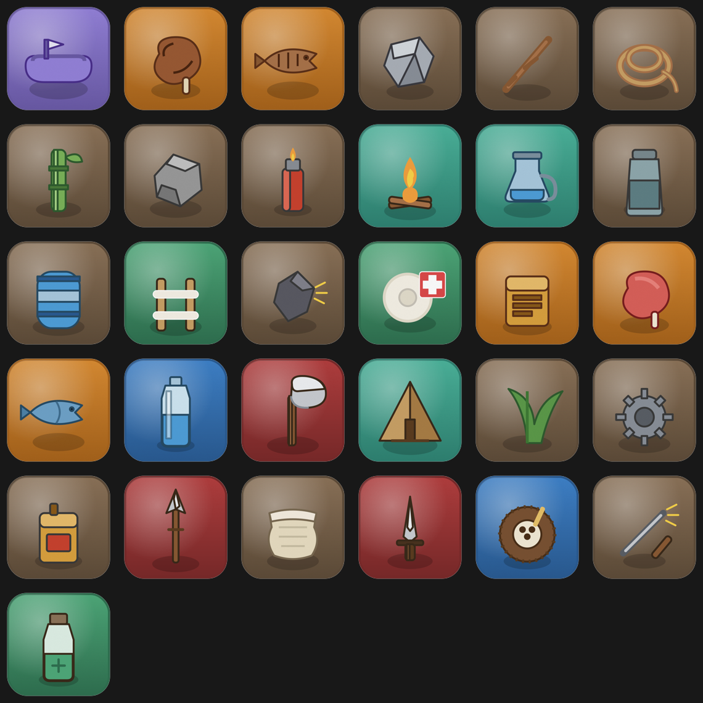

# MakeGame — 무인도 탈출 서바이벌

Stranded Deep을 참고한 1인용 3D 무인도 탈출/서바이벌 게임. Unity 6 (URP) 기반.

비행기 추락으로 무인도에 불시착한 플레이어가 생존 수치를 관리하며 자원을 채집하고,
여러 섬을 탐험해 배(고무보트→뗏목→범선)를 완성하거나 경비행기를 수리해 섬을 탈출하는 것이 목표.

아이템 아이콘 31종 미리보기 (인벤토리/제작 UI에서 실제로 사용됨):

## 1. 실행 방법

1. [Unity Hub](https://unity.com/download)에서 **Unity 6 (6000.5.6f1)** 이상 설치
2. Unity Hub → **Open** → 이 폴더(`D:\MakeGame`) 선택
3. `Assets/Scenes/SampleScene.unity`를 열고 Play
4. 타이틀 화면에서 "시작하기"를 누르면 플레이가 시작된다

## 2. 조작법

| 키 | 기능 |
| --- | --- |
| W/A/S/D | 이동 |
| 마우스 | 시점 회전 (상하 -80°~80° 제한) |
| Space | 점프 / 수영 중 위로 부상 |
| Ctrl | 수영 중 잠수 |
| E | 상호작용 · 공격(무기 필요) |
| R | 조리 (모닥불 앞) / 사망 시 재시작 |
| C | 아이템 섭취 |
| G | 설치형 아이템(물 증류기, 쉼터 등) 설치 |
| Tab | 인벤토리 열기/닫기 |
| V | 제작(크래프팅) 창 열기/닫기 |
| M | 미니맵 섬 목록/이동 패널 열기/닫기 |
| F5 / F9 | 저장 / 불러오기 |
| Esc | 설정(음량) 화면 열기/닫기 |
| Space (엔딩 화면) | 엔딩 연출 닫고 계속 플레이 |

## 3. 구현된 시스템

### 생존
- 체력/허기/갈증/일사병/산소 수치와 중독·출혈·골절 상태 이상 (`SurvivalStats`, `SurvivalTickDriver`)
- 경과 일수 카운트 (`SurvivalClock`)
- 사망 시 Game Over 화면 및 씬 재시작 (`GameOverController`)

### 채집 · 제작 · 생존 활동
- 자원 채집(하베스팅), 모닥불/요리, 사냥/낚시, 아이템 섭취(`ConsumptionSystem`)
- 제작 레시피/크래프팅 시스템 (`CraftingSystem`), 스킬 레벨링 (`PlayerSkills`)
- 설치형 아이템: 물 증류기(WaterStill), 쉼터(Shelter) — 다중 프리미티브 조합 프리팹

### 섬 · 월드
- 절차적 섬 생성 및 확장 배치, 실제 지형 메시 (`IslandGenerator`, `WorldMapManager`)
- 섬 규모(소/중/대/특대)별 자원·위험요소 분포, 대형/특대 섬 최소 생성 개수 보장
- 희귀 자원(금속조각/부력통/엔진부품)의 섬 규모 기반 스폰 제한
- 바다 수영/잠수, 뗏목·고무보트를 통한 섬 간 이동 (`IslandTravel`)
- 미니맵 레이더 + 섬 목록/이동 UI (`MinimapUI`)

### 위험 요소
- 독사/전갈/곰/벌떼/함정/식인종 — 종류별 상태이상·직접피해 로직 (`HazardSource`)
- 전투 가능 대상(곰/식인종/벌떼)은 무기로 물리치면 일정 시간 후 재등장
- 종류별로 형태·크기·색상이 다른 시각화(캡슐/구체/원판 조합)로 한눈에 구분 가능

### 날씨 · 환경 연출
- 맑음/비를 오가는 날씨 사이클, 비 파티클과 절차적 빗소리, 비가 올 때 태양광 밝기 추가 감쇠 (`WeatherSystem`)
- 하루 진행률에 따른 태양 각도/밝기/색온도 변화 (`DayNightCycle`)
- 섬과 섬 사이 깊은 바다에 배치되는 상어 위험요소, 수영/잠수 중에만 조우 (`SharkSpawner`)

### 엔딩
- 배 제작: 고무보트 → 뗏목 → 범선 3단계, 도면과 재료 수집으로 진행 (`BoatConstructionSystem`)
- 경비행기 수리 엔딩 (`AircraftRepairSystem`)
- 엔딩 달성 시 축하 UI 연출 (`EndingChecker`)

### 기타
- 인벤토리/제작 UI (아이템 카테고리별 색상 아이콘, 재료 부족 여부 개별 표시)
- 저장/불러오기 (`SaveLoadController`)
- 효과음/배경음 (`AudioManager`)
- 정식 생존 HUD: 체력/허기/갈증/일사병/산소를 색상 막대 바로, 중독/출혈/골절을 활성화 시에만 보이는
  아이콘으로 화면 좌상단에 상시 표시 (`SurvivalHudUI`). QA/디버깅용 raw 숫자 패널은 `DebugHud`로 분리해
  화면 우상단에 유지
- 타이틀 화면(시작/설정/종료)과 음량 설정 화면 (`MainMenuController`, `SettingsMenuController`)

## 4. 코드 컨벤션

- 기능을 구현하는 모든 메서드에는 **어떤 기능인지 설명하는 한글 주석**을 남긴다.
- 새 스크립트는 역할에 맞는 하위 폴더(`Player/`, `Systems/`, `UI/`, `Managers/`, `Utils/`)에 배치한다.
- 절차적 시각 요소(색상 머티리얼 등)는 `.mat` 에셋을 늘리기보다 `StructureVisualBuilder.CreateColorMaterial`처럼 런타임 생성 방식을 우선 검토한다. 다만 프리팹에 고정 배치되는 파츠는 실제 `.mat` 에셋으로 만들어 안정적으로 참조한다.

## 5. Git 워크플로

- `main` 브랜치에 직접 커밋. 버전은 `x.xx.xxx` 형식으로 커밋마다 `Tools/bump_version.sh`로 patch를 1씩 올린다.
- Unity 에디터의 **Version Control Mode = Visible Meta Files**, **Asset Serialization = Force Text** 설정 필수.
- 원격 저장소: `wlfekymk/MakeGame` (private). 커밋 후 `git bundle create --all`로 `repo.bundle` 백업을 함께 갱신한다.

## 6. 버전 히스토리 요약

| 범위 | 내용 |
| --- | --- |
| v0.01.001–009 | 프로젝트 초기 셋팅, Git/버전 관리 체계, Unity 3D URP 프로젝트 생성, 스토리 딕셔너리(설계 문서) 기반 구축 |
| v0.01.010–018 | 생존 수치, 위험 요소, 섬/월드맵 생성, 스킬/제작 시스템, 플레이 가능한 핵심 루프 최초 구현 |
| v0.01.019–022 | 입력 시스템 수정, 설치형 아이템(물 증류기/쉼터), 배 도면 스포너, 인벤토리/제작 UI, 섬 지형 실제 메시화 |
| v0.01.023–030 | 물 증류기/쉼터 시각 개선(1차), 바다 수영·잠수, 배 제작 밸런스, 위험요소 전투, 저장/불러오기, 사운드, 경비행기 엔딩, 풀 플레이테스트(배 작업대 누락 버그 발견·수정) |
| v0.01.031–036 | 사망 처리(Game Over), 엔딩 승리 UI, 희귀 재료 밸런스, 대형/특대 섬 최소 생성 보장, 인벤토리/제작 UI 시각 개선, 미니맵/섬 목록 UI(섬 이동 기능 최초 연결) |
| v0.01.037–038 | 쉼터/물 증류기 프리팹 디테일 개선(다중 파츠 조합, 신규 머티리얼 3종), 위험 요소 시각 개선(종류별 형태/색상 구분) |
| v0.01.039–041 | README/밸런스 재검토, 대형 섬 최소 2개 보장 및 배 도면 획득 확률 상향(1~2단계 도면이 영영 안 나오는 소프트락 수정), 메인 메뉴/타이틀 화면과 음량 설정 화면 추가 |
| v0.01.042 | 상태 이상 UI 경고 강화, 낚시/사냥 UX 및 인벤토리 정렬 점검, 저장/불러오기 worldSeed 재현 검증, 풀 플레이테스트 3차 |
| v0.01.043 | 모닥불 죽은 콘텐츠 버그 수정(프리팹/키트/레시피 신규 추가로 요리 시스템을 실제로 도달 가능하게 함), 물 증류기/쉼터/배 제작/경비행기/사망 흐름 재검증, 상태 이상 경고 배너 가독성 개선 |
| v0.01.044 | **치명적 소프트락 2건 수정**: ① 미니맵 섬 목록의 이동 버튼이 "발견된 섬"만 활성화되어 있어 시작 섬 밖 어떤 섬에도 절대 갈 수 없던 순환 잠금, ② 고무보트가 대형 섬까지 막고 있어 배 1~2단계 도면(대형 섬 전용)을 영원히 구할 수 없던 배 엔딩 경로 전체 잠금. 두 건 모두 Play 모드에서 라이브로 재현·수정 검증 완료. 그 외 아이템 획득 경로 전수 감사(31종 전부 정상), 위험요소 배치/전투 재검증, 사운드 이벤트 누락 3건(사냥 성공/모닥불 점화/아이템 설치) 보강, 엔딩 UI·설정 볼륨 실시간 반영 재검증 |
| v0.01.045–046 | 경비행기 재료/섬 생성/스킬 레벨/레시피 순환/밸런스 전반 재검증, **세이브·로드 시 섬 발견 상태가 저장되지 않아 불러올 때마다 탐험 기록이 초기화되던 버그 수정**(discoveredIslandIds 추가), **치명적 소프트락 3번째 건 수정**: 섬 이동이 성공 처리만 하고 플레이어를 실제로 텔레포트시키지 않던 버그(CharacterController 비활성화 후 위치 대입 방식으로 해결, 소형/대형 섬 모두 실측 검증) |
| v0.01.047 | **설정 볼륨이 재실행할 때마다 기본값으로 리셋되던 버그 수정**(PlayerPrefs 저장/복원 추가), 사망 후 재시작/크래프팅 UI 피드백/인벤토리 용량/위험요소 밸런스/두 엔딩 경로 상호작용/섬 재생성 성능/한글 문자열 전수 재검토(모두 정상 확인) |
| v0.01.048 | 경비행기 재료 스폰/배 도면 획득/설정 Esc 대체키(F5 정상 확인)/전투 이펙트/밤낮 주기/온보딩 재점검(대부분 정상, 일부는 향후 과제로 문서화), **사망 원인별 게임 오버 메시지 다양화**(굶주림/일사병/중독/출혈/익사/맹수 7종 문구 추가), **월드 자원 노드 색상 구분 추가**(기존엔 전부 회색 큐브라 나뭇가지/돌조각/코코넛 등이 시각적으로 전혀 구분되지 않던 문제를 UIBuilder.GetItemCategoryColor 재사용으로 해결) |
| v0.01.049 | **전투 피격 시각 이펙트 신규 구현**(CombatFeedbackUI, 위험요소 접촉 순간에만 화면 테두리가 붉게 번쩍임 - 상시 피해와는 분리해 부작용 방지), **밤/낮 주기 및 조명 변화 신규 구현**(DayNightCycle, SurvivalClock의 하루 진행률에 맞춰 태양 각도/밝기/색온도가 실시간으로 변화, 자정=암흑→새벽/정오=밝음 라이브 검증 완료), **잠수 산소 소모 버그 수정**(발 위치만으로 잠수 여부를 판정해 정상적인 수면 위 수영 중에도 산소가 거의 항상 줄어들던 문제를 머리 높이 기준 판정으로 수정), 도구 요구 채집/사냥 무기 확보 경로/크래프팅 스킬레벨/세이브 슬롯 재검증(사냥용 창 요구 정상 확인, 손도끼 설명 문구가 실제로 없는 "채집 속도 증가" 효과를 홍보하던 문제 수정) |
| v0.01.050 | **일사병-밤/낮 정합성 수정**(그늘 밖이라도 밤에는 햇빛이 없으므로 일사병이 더 이상 오르지 않고 오히려 식도록 수정), **재시작 시 DayNightCycle 소실 버그 수정**(RuntimeInitializeOnLoadMethod.AfterSceneLoad가 최초 씬 로드에만 호출되고 재시작 같은 이후 씬 재로드에는 호출되지 않아, 사망 후 재시작하면 밤/낮 주기가 조용히 사라지던 문제를 SceneManager.sceneLoaded 이벤트 구독 방식으로 수정 - 재시작 라이브 테스트로 재현 및 해결 확인), CombatFeedbackUI 중복 생성 없음/게임오버 화면 상호작용/배경음 간섭 없음/그늘 판정 일관성 재검증 |
| v0.01.051 | **인벤토리/제작 UI에 아이템·레시피 설명 문구 표시 추가**(ItemData.description, CraftingRecipe.description이 그동안 어떤 UI에도 표시되지 않는 죽은 데이터였던 문제 수정 - 인벤토리는 아이템명 아래, 제작 UI는 헤더와 재료 줄 사이에 회색 작은 글씨로 표시), 전체 컴파일 재검증(0 에러/0 경고), 사망→재시작 라이브 테스트로 DayNightCycle/CraftingCanvas/InventoryCanvas 등 신규 UI 재생성 중복 없음 재확인 |
| v0.01.052 | **story_dictionary openQuestions 스테일 항목 정리**(전투 이펙트/밤낮 주기는 이미 구현 완료, 도면 확률은 이미 90%/95%로 상향된 상태였음을 반영), 경비행기/배 재료 수량·도면 확률·뗏목 이동범위 기준 재검토(모두 기존 값이 적정하다고 판단, 변경 없음), 전투 사운드 피드백 기존 구현 확인, 긴 설명 텍스트(88자) 줄바꿈 시 재료 줄과 겹치지 않음을 라이브 검증 |
| v0.01.053 | 쉼터/물증류기 시각 품질(다중 프리미티브 조합) 재확인, 위험요소 재등장 타이머(120초) 코드 검증, 상태 이상 경고 배너가 OnGUI 오버레이라 밤/낮 조명 영향을 받지 않음을 확인, 경비행기 수리 진행도 세이브/로드 F5/F9 라이브 재검증, 인벤토리 정렬이 매 갱신마다 카테고리→이름순으로 결정적으로 재계산됨을 확인, 사망 원인 메시지 6종+기본값 매핑 전수 재확인 - 모두 기존 구현이 적정하다고 판단, 코드 변경 없음 |
| v0.01.054 | **미발견 섬 목록의 규모(대형/특대 등) 정보 노출 버그 수정**(방문하지 않은 섬도 실제 규모가 그대로 보여서, 어느 섬이 도면·희귀 재료가 나오는 대형/특대 섬인지 목록만 보고 미리 알 수 있던 문제를 "미확인"으로 가려 실제 항해로만 알 수 있게 수정), 인벤토리+제작 UI 동시 오픈 레이아웃 충돌 없음/스킬 레벨업 곡선/코코넛 과음 메커니즘(의도된 리스크로 확인)/두 엔딩 동시 달성 시나리오 재검증 |
| v0.01.055 | 사냥/낚시 성공확률(70%)·재등장(90초), 모닥불 조리(즉시 성공, 실패 조건 없음은 의도된 단순화), 설치형 아이템 중복 설치 제한 없음(Stranded Deep처럼 여러 개 배치해 생산량을 늘리는 것은 정당한 전략으로 판단), 배 작업대 상호작용 범위(다른 대상과 동일한 4m 공용 레이캐스트)를 재검토 - 모두 기존 구현이 적정하다고 판단, 코드 변경 없음 |
| v0.01.056 | **정식 생존 HUD(SurvivalHudUI) 신규 구현**: `DebugHud`가 처음부터 "정식 UGUI 인터페이스가 만들어지기 전까지"의 임시 화면이라고 스스로 밝혀왔던 부분을 실제로 구현 - 체력/허기/갈증/일사병/산소를 색상 막대 바(UIBuilder.CreateProgressBar 신규 헬퍼)로, 중독/출혈/골절을 활성화 시에만 나타나는 아이콘으로 표시. DayNightCycle과 동일한 재시작 대응 패턴 적용, 좌상단 신규 HUD와 겹치지 않도록 기존 DebugHud(QA용 raw 숫자 패널)는 우상단으로 재배치. 체력 변화/상태이상 발생/재시작 시 재생성 모두 라이브 검증 완료 |
| v0.01.057 | **생존 바 위험 수치 색상 경고 추가**: SurvivalHudUI의 체력/허기/갈증/산소가 낮거나(각 25%/20%/20%/25% 미만) 일사병이 높을 때(80% 초과) 막대가 빨간색으로 규칙적으로 펄스(Time.unscaledTime 기반이라 일시정지에도 영향받지 않음). **날씨(비) 연출 시스템 신규 구현(WeatherSystem)**: 맑음(90~240초)과 비(40~100초)를 오가며, 비가 오면 플레이어 머리 위에서 파티클이 내리고 절차적 빗소리(AudioManager 신규 전용 채널, 파도 배경음과 동시 재생)가 재생되며 DayNightCycle의 태양광 밝기에 배율(rainDimFactor)이 곱해져 어두워짐 - 두 스크립트가 같은 프레임에 sunLight.intensity를 직접 덮어써 값이 튀는 것을 막기 위해 DayNightCycle이 WeatherSystem.IsRaining을 읽어 자기 계산 결과에 곱하는 단방향 의존 구조로 설계. **버그 수정**: 비 파티클에 셰이더를 지정하지 않아 URP 프로젝트에서 마젠타(셰이더 없음) 점으로 보이던 문제를 라이브 플레이테스트로 발견, Universal Render Pipeline/Particles/Unlit 셰이더를 명시적으로 지정해 해결. 재시작 시 WeatherSystem 단일 인스턴스 재생성(중복 없음) 라이브 검증 완료 |
| v0.01.058 | **바다 위험요소(상어) 신규 구현**: 수영/잠수 시스템은 있었지만 바다 자체에는 아무 위험이 없어 넓은 바다를 헤엄쳐 건너는 데 긴장감이 전혀 없던 공백을 메움. HazardType.Shark 신규 추가, HazardSpawner의 형태/전투 설정 테이블(GetVisualConfig/ConfigureForType)을 그대로 재사용하는 SharkSpawner를 새로 만들어 모든 섬 생성이 끝난 뒤 섬과 최소 35m(시작 섬은 60m) 떨어진 바다 한가운데, 해수면 2m 아래에 상어 6마리를 배치. 상어는 곰보다 체력은 낮지만(25) 직접 피해량은 가장 높게(18) 설계해 "물속에서는 무기를 쓰기 어렵다"는 위협감을 표현. 사망 원인을 기존 Predator와 분리한 DamageCause.SharkAttack으로 기록해 게임 오버 화면에 "바닷속에서 상어의 습격" 전용 문구가 뜨도록 함. Play 모드에서 상어 6마리가 정확히 스폰되고 HazardSource의 종류/피해량/체력이 설계대로 설정된 것을 Inspector로 라이브 확인, 콘솔 0 에러 |
| v0.01.059 | 밤 시간대 저체온(추위) 메커니즘 도입 검토(코드 확인 결과 현재는 밤이 되면 일사병만 회복될 뿐 별도 위험이 없음을 확인, 다만 신규 스탯 도입은 날씨 시스템급 규모라 이번 배치에서는 설계만 openQuestions에 기록하고 구현은 보류), 조난자 구조 NPC 시스템 도입 검토(story_dictionary의 premise/npc가 "단독 불시착"을 명시하고 있어 도입하지 않기로 결정) - 둘 다 코드 변경 없이 검토 결론만 story_dictionary.json openQuestions에 기록 |
| v0.01.060 | 상어 위험요소 실측 검증 배치: Play 모드에서 플레이어를 실제 상어 좌표로 순간이동시켜 접촉 피해(약 26.5)·출혈 상태·경고 배너가 기존 위험요소와 동일한 방식으로 정상 작동함을 확인, 미니맵이 애초에 어떤 위험요소 위치도 노출한 적이 없어 상어로 인한 신규 정보 노출 문제가 없음을 코드로 확인, 전투형 위험요소 6종(벌떼/상어/식인종/곰 등) 체력·피해량 균형이 "상어는 체력 대비 피해량이 가장 높다"는 의도된 설계를 유지하고 있음을 재확인 - 모두 기존 구현이 적정하다고 판단, 코드 변경 없음 |
| v0.01.061 | 인벤토리 아이템 아이콘 다양성 재검토: `InventoryUI.CreateRow`가 풀링용 행을 새로 만들 때 아이콘을 회색+"?"로 초기화하는 코드를 보고 처음엔 CraftingUI와 달리 카테고리 색상을 안 쓰는 버그로 의심했으나, 실제 목록 갱신 루프(`RefreshList` 242~249행)에서 매번 `UIBuilder.GetItemCategoryColor(data)`와 아이템 이름 첫 글자로 아이콘 색상/문자를 다시 채우고 있음을 코드로 확인 - 회색+"?"는 데이터가 채워지기 전 풀링 행의 초기값일 뿐이라 실제 인벤토리 화면에는 항상 카테고리별 색상이 정상 표시됨을 재확인, 오탐(false alarm)으로 결론, 코드 변경 없음 |

| v0.01.062 | **도구 내구도(durability) 시스템 실제 연결**: 무기(칼/손도끼/창)의 `maxUses`/`remainingUses`가 세이브·UI 표시까지 다 준비돼 있었지만 정작 전투/채집/사냥에서 실제로 소모되지 않던 문제를 고쳐 `PlayerInventory.UseItem`을 세 경로 모두에 연결(전투는 곰 공격으로 칼 10→9회 라이브 검증, 사냥은 씬 데이터 대조로 창 요구 확인). **취침/휴식 시스템(Shelter.TrySleep) 신규 구현**: 밤에 쉼터에서 상호작용하면 다음날 일출까지 시간을 건너뛰고 체력 15 회복 + 일사병 초기화(라이브 검증: `elapsedSeconds`가 공식대로 정확히 점프, sunstroke 리셋 확인 - 검증 도중 갈증 고갈로 캐릭터가 사망해 GameOverController 정상 작동도 부수 확인됨). **위험한 순환 소프트락 예방**: 채집에도 도구 요구를 걸 수 있도록 `IslandResourceSpawner.ResourceEntry`에 `requiresTool`/`requiredTool` 필드를 추가했으나, 나뭇가지 채집에 손도끼를 요구하도록 설정했다가 "손도끼 제작 재료가 나뭇가지"라는 순환 의존(나뭇가지 없이는 손도끼를 못 만들고, 손도끼 없이는 나뭇가지를 못 캐는 상태)이 될 뻔한 것을 발견해 저장 전 즉시 비활성화로 되돌림 - 코드 인프라는 완성했지만 실제 자원에는 아직 미적용, 향후 적용 시 체크리스트를 openQuestions에 기록 |

| v0.01.063 | **채집 도구 요구 인프라 실제 활성화(첫 사례)**: 레시피 재료 전수 대조로 금속조각/부력통/비상식량/연료/엔진부품이 어떤 도구 레시피에도 재료로 쓰이지 않음을 확인해, 대형섬 전용 희귀 자원인 금속조각 채집에 손도끼를 요구하도록 안전하게 활성화(총수요 12개 vs 대형섬 1곳 채집 여력 최대 18회·손도끼 내구도 20회로 병목 없음 실측). **인벤토리 UI에 실제 내구도 표시 추가**: 그동안 "최대 N회 사용"이라는 고정값만 보여줘 지금 몇 번 남았는지 알 수 없었던 문제를 고쳐 "(현재/최대회 남음)" 형식으로 표시하고, 20% 이하면 빨간색·40% 이하면 노란색으로 강조. 그 외 치료 아이템 연결/무기 내구도 세이브 저장/쉼터 취침-세이브 상호작용을 코드로 재점검한 결과 모두 기존 구현이 이미 정상이라 변경 없음 |

| v0.01.064 | 부력통/비상식량/연료/엔진부품은 표류물 성격이라 도구 요구를 걸지 않기로 결정(금속조각만 유지, 코드 변경 없음), **무기 파손 시 파손 전용 효과음 추가**(내구도 소진으로 인벤토리에서 조용히 사라져도 알 방법이 없던 문제 수정), **고아 시작 아이템 버그 수정**: 라이터(시작 아이템, 유한 5회)가 `Campfire.TryLight`에서 파이어스타터(무제한)만 확인해 실제로는 아무 기능이 없었던 것을 발견해 대체 발화 도구로 연결(파이어스타터 우선, 없으면 라이터 사용). 풀 플레이테스트 19차: Play 모드에서 Alternate Fire Starter Item 필드에 라이터가 정상 할당됨을 라이브 확인했으나, Game 뷰 클릭 시 포커스 확보와 FPS 마우스룩이 동시에 발생해 정확한 조준 상태에서 E키 상호작용까지는 재현하지 못함(같은 FindItem+UseItem 소모 경로가 이미 손도끼 내구도로 검증된 점을 근거로 코드 검토로 갈음) |

| v0.01.065 | 라이터 고아 아이템 수정(v0.01.064)과 관련된 주변 시스템을 전수 재점검하는 배치: 발화 도구 우선순위 로직(무제한 우선)·세이브/로드 보존·모닥불 연료/조리 로직의 점화 수단 무관성·씬 내 모닥불 인스턴스가 프리팹 하나뿐임·파이어스타터 레시피가 도구 없이 최저 티어로 어디서나 도달 가능함·전체 아이템 중 진짜 내구도 도구(maxUses>1)는 라이터/손도끼/창/칼 4종뿐이며 모두 정상 연결됨을 코드로 확인 - 모두 기존 구현이 이미 정상이라 코드 변경 없음. 라이터의 실제 E키 점화 상호작용 라이브 재현은 플레이어 스폰 높이/카메라 피치가 세션마다 달라 컴퓨터 사용 자동화로 정밀 조준을 맞추기 어렵다고 최종 판단해 중단하고, 이미 라이브 검증된 FindItem+UseItem 공통 경로에 대한 신뢰를 근거로 코드 검토로 갈음(추후 에디터 전용 강제 상호작용 훅 도입을 openQuestions에 기록) |

| v0.01.066 | **아이템/자원/섬 시각 디테일 개선**: `ItemData`에 `icon`(Sprite) 필드를 신설하고 아이템 31종 전체에 카테고리 색상 배경 + 실루엣 글리프로 구성된 512x512 아이콘을 자체 제작(SVG→PNG)해 연결(`Assets/_Project/Art/Sprites/`), InventoryUI·CraftingUI가 아이콘이 있으면 실제 그림을, 없으면 기존 문자 placeholder를 보여주도록 수정. 월드의 자원 노드/사냥감/위험요소/설치물이 전부 단색 프리미티브로만 보이던 문제를 개선해, 절차적 흑백 그레인 텍스처(모래/돌/나무/일반) 4종을 `Resources/Textures/`에 두고 섬 지형·자원 노드·`StructureVisualBuilder`(쉼터/물증류기/모닥불/사냥감/위험요소 공용 진입점)에 곱해 씌움. README/문서용 섬 컨셉 아트와 아이콘 검수 시트를 `Docs/ConceptArt/`에 추가. 미확인 위험: Unity 에디터가 실행되지 않은 상태에서 스프라이트/텍스처 .meta를 직접 작성했고 Play 모드 라이브 확인은 다음 세션 과제로 남음(`story_dictionary.json`의 `batch268to286ItemIconsAndSurfaceTextures` 참고) |

| v0.01.067 | v0.01.066 아트 시스템 라이브 검증 + 후속 정리: `UIBuilder.GetItemCategoryColor`에 의료(초록) 카테고리 분기를 추가해 붕대/부목/해독제 아이콘 색과 인벤토리 카테고리 점 색이 일치하도록 수정, README에 섬 컨셉 아트·아이콘 시트 이미지 삽입, 배 도면(BoatBlueprintPickup)에 그동안 없던 머티리얼을 추가(금색 + 표면 텍스처)해 기본 흰 구체로만 보이던 문제 수정. **실제 Unity 에디터에서 라이브 검증 완료**: 스크립트 재컴파일 성공(콘솔 에러 0건), 아이콘 31종·텍스처 4종이 실제 아트워크로 정상 임포트됨을 Project 창에서 확인, Play 모드에서 인벤토리(Tab)·제작(V) UI에 아이콘이 실제로 표시되는 것을 확인 |

| v0.01.068 | **배경/이펙트 시각 폴리시 2차 배치(#305~323)**: 타이틀·GameOver·승리 화면에 배경 아트/톤 적용, 스카이박스 색조·`ColorAdjustments`(대비/채도) 포스트프로세싱 신규 추가, 바다 머티리얼에 물결 텍스처 적용, 자원 텍스처에 leaf/metal 2종 추가(잎/금속 구분), 아이콘 배경 그레인·위험요소/사냥감 프리팹에 눈·지느러미·꼬리 등 보조 파츠 디테일 추가. **미니맵 개선**: 그동안 sprite 없는 사각형이었던 레이더 점을 원형(`radar_dot`) + 흰 테두리 링(`radar_ring`)으로, 방향 정보가 없던 플레이어 점을 시선 방향으로 회전하는 삼각 화살표(`player_arrow`)로 교체. **HUD 상태바 개선**: `UIBuilder.CreateProgressBar`에 둥근 캡슐 스프라이트(`bar_rounded`) + `Mask`를 적용해 각진 막대를 둥글게 바꾸고, 체력/허기/갈증/일사병/산소 라벨 앞에 글리프 아이콘을, 상태이상(중독/출혈/골절) 아이콘을 해골/핏방울/뼈 글리프로 교체. **날씨 이펙트 개선**: 빗방울을 Stretched Billboard로 바꿔 빗줄기처럼 보이게 하고, 비가 오는 동안 얕은 안개(Exponential Fog)를 깔아 습한 분위기를 더함. **버그 수정**: 이전 배치에서 추가된 `HazardSpawner`의 벌떼 파츠 배치 코드가 이 Unity 버전에서 컴파일 에러로 바뀐 `Object.GetInstanceID()`를 사용하고 있던 것을 발견해 `UnityEngine.Random` 기반으로 교체(라이브 컴파일에서 에러 0건 확인 후 발견 - Assets/Refresh 강제 재컴파일의 필요성을 재확인). Play 모드에서 타이틀→인게임→인벤토리(Tab) 전 구간 라이브 검증, 콘솔 에러/경고 0건 |

| v0.01.069 | **자원 노드 모양 전면 개선(사용자 피드백)**: "인게임에서 육각형 상자들이 뭘 나타내는지 모르겠다"는 직접 피드백을 받아 원인을 확인 - `IslandResourceSpawner`가 나뭇가지/돌조각/코코넛/금속조각 등 12종 자원 전부를 동일한 큐브(1x1.5x1)로만 만들어서, 비스듬한 카메라 각도에서 큐브 옆면 3개가 보여 전부 "색만 다른 육각형 상자"처럼 보였던 것이 원인. `GetNodeShape`로 자원별 실제 프리미티브(원기둥/구/납작한 상자)와 크기를 다르게 하고, `AddResourceDetailParts`로 보조 파츠를 덧붙여 실루엣만으로 구분 가능하게 함: 나뭇가지=곁가지 3개짜리 다발, 대나무=마디 3개 있는 키 큰 기둥, 돌조각=바위 3개 무더기, 부싯돌=비스듬한 얇은 파편, 코코넛=구 2개, 천조각=접힌 자국 있는 납작한 천, 야자잎=줄기+부채꼴 잎 5장, 금속조각=꺾인 금속판 2겹, 부력통=테두리 있는 드럼통, 비상식량=라벨 붙은 상자, 연료=주둥이 있는 각진 통, 엔진부품=볼트 4개 있는 원판. 프리미티브 종류별 피벗 높이 차이(큐브/구는 half-height=scale.y*0.5, 실린더는 scale.y*1)를 `GetHalfHeight`로 보정해 어떤 모양이든 바닥에 정확히 닿게 함. Play 모드 Scene 뷰에서 실제로 기둥/드럼통/구체 등 서로 다른 실루엣이 배치되는 것을 라이브 확인 |

세부 설계 근거와 발견된 버그 기록은 `Docs/Story/story_dictionary.json`을 참고.
